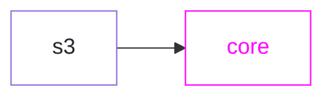

# %%SPEC-NAME%%

<h2>%%SPEC-TITLE%%</h2>

```raw html
<table class=spec-data>
  <tr><td>Status</td><td>Draft</td>
  <tr><td>Version</td><td>%%SPEC-VERSION%%</td>
</table>
<link rel=stylesheet href=https://specs.apollo.dev/apollo-light.css>
<script type=module async defer src=https://specs.apollo.dev/inject-logo.js></script>
```



This document defines a [core feature](https://specs.apollo.dev/core) named `%%SPEC-NAME%%` for  ...

This specification provides machinery to:
- _Provide an example.  See other specifications for inspiration._

# How to read this document

This document uses [RFC 2119](https://www.ietf.org/rfc/rfc2119.txt) guidance regarding normative terms: MUST / MUST NOT / REQUIRED / SHALL / SHALL NOT / SHOULD / SHOULD NOT / RECOMMENDED / MAY / OPTIONAL.

## What this document isn't

Example Text: This document specifies only the structure and semantics of supergraphs. It's expected that a supergraph will generally be the output of a compilation process which composes subgraphs. The mechanics of that process are not specified normatively here. Conforming implementations may choose any approach they like, so long as the result conforms to the requirements of this document.

# Example: Usage

_Provide or remove this section._

# Overview

*This section is non-normative.* It describes the motivation behind the directives defined by this specification.

_Provide this section._

# Basic Requirements

_Provide this section._

Here is an example usage:

:::[definition](spec.graphql)
